# New-API 新功能说明书（historyhub 网页端）

> 适用对象：普通用户 / 运维人员 / 后续开发者
> 覆盖范围：目录 `/data/hyb/new-api/0/` 当前源码**实际落地**的功能；截图取自与生产同构的验证环境（渠道 `gd-llm`，模型 `GD-LLM / GD-LLM-Lite / kimi-k2.5 / moonshot-v1-8k`，账号「何工」），界面与生产完全一致。

## 第 1 章 仓库与代码库介绍（HistoryHub）

> 本章写给第一次拿到本仓库的人：它是什么、基于哪个版本、怎么跑起来。功能使用说明见「一 ~ 十」章，开发边界见第十章（Z 编号）。

### 1.1 一句话定位

**HistoryHub** 是大模型聚合平台 [QuantumNous/new-api](https://github.com/QuantumNous/new-api) 的**网页聊天前端 + 历史记录中心**。它不改动上游主体，而是以一个自包含插件目录 `0/`（Go 包名 `historyhub`）并入 new-api 源码树：**同一个二进制、同一个进程、两个端口**

- 主服务（管理台 + API 网关）：默认 `127.0.0.1:3000`（仅本机回环，`--ipPortMain` 可改）；
- HistoryHub 网页端：默认 `0.0.0.0:3001`，浏览器直接访问（`--ipPortHyb` 可改）。

| 核心能力 | 说明 | 详见 |
|---|---|---|
| 网页对话 | 流式/非流式输出、思考过程、图片与文本附件 | 第三章 B |
| 历史回放 | 会话分组列表、逐轮回放、API 直连会话统一展示 | 第四章 C |
| 搜索与高亮 | 问题/答案双向检索（AND/引号/竖线/排除/日期）、命中高亮 | 第五章 D |
| API 密钥 | 网页端自建/管理 `sk-` 密钥（额度/模型/IP 白名单） | 第六章 E |
| 钱包 | 余额与消费流水只读展示 | 第七章 F |

### 1.2 基线版本与差异面

| 项 | 值 |
|---|---|
| 上游仓库 | `https://github.com/QuantumNous/new-api.git` |
| 基线提交 | `ccd535ef`（main，2026-08-11；`git describe` = `v1.0.0-rc.24-18-gccd535ef`，即 v1.0.0-rc.24 之后再 18 个提交） |
| 本仓库范围 | 仅 `0/` 目录：Go 后端 + `web/` 手写前端 + 本说明书与截图 |
| 依赖的上游改动 | 仅 2 个白名单文件、约 25 行（见 1.4 第 3 步），不随本仓库分发 |
| 数据存储 | 按用户分库的独立 sqlite 文件（`hybdb/u<uid>.db`），不改上游数据库表结构 |

开发红线（完整清单见第十章 Z 编号）：新功能代码只进 `0/`；上游 `git pull` 更新后重新编译，`0/` 不得报错。

### 1.3 目录结构

```text
0/
├── server.go        # 包级 init() 自启 :3001 服务；注册 /web 静态站与 /hybapi/* 接口
├── config.go        # 命令行/环境变量配置（ipPortMain、ipPortHyb 等）与 MainAddr
├── proxy.go         # 复用主服务转发链路调用模型；非流式渠道的 SSE 探测（sseProbe）
├── store.go         # 历史库：按用户分库的 sqlite（hybdb），会话/消息存取与搜索语法解析
├── ssemerge.go      # SSE 流合并、问答日志落盘
├── web.go           # go:embed 打包 web/ 静态前端
├── webauth.go       # 登录态：复用主站用户体系与 session
├── webpass.go       # 修改密码：复用主站校验与加密函数
├── webkeys.go       # API 密钥管理：复用 model.Token，零新表
├── webwallet.go     # 钱包：只读聚合展示
├── *_test.go        # 单元测试（搜索矩阵 / SSE 合并 / 流探测 / 密码密钥钱包）
├── web/             # 前端：index.html + css/ + js/，手写、无任何构建工具
├── README.res/      # 本说明书截图（39 张 PNG）
└── 0.md, 01.md, 02.md   # 需求与开发过程文档（历史存档）
```

### 1.4 快速开始（并入上游源码树并编译）

```bash
# 1) 取上游源码（≥ v1.0.0-rc.24；本仓库验证基线为 ccd535ef）
cd /data/hyb/
git clone https://github.com/QuantumNous/new-api.git

# 2) 把本仓库放到上游根目录的 0/ 下
cd /data/hyb/new-api/
git clone https://github.com/dh-realtime/new-api-historyhub.git 0

# 3) 手工应用两处白名单改动（改的是上游文件，不在本仓库内）：
#    main.go
#      + import "github.com/QuantumNous/new-api/0"        # 包 init() 会在 0.0.0.0:3001 自启网页端
#      - Addr: ":" + port
#      + Addr: historyhub.MainAddr(port)                  # 主服务默认收窄为 127.0.0.1:3000
#    controller/user.go（约 23 行）
#      + var phoneRegexp / func requireMobileUsername()   # 用户名强制 11 位手机号
#      + CreateUser / UpdateUser 入口调用                  # 历史与日志按用户名分库归档

# 4) 在本地安装 Bun 运行时，然后用它安装依赖并构建前端项目，最后确认构建产物 dist 目录已生成
cd /data/hyb
curl -fsSL https://bun.sh/install | BUN_INSTALL="$PWD/bun" bash
export PATH="$PWD/bun/bin:$PATH"
bun --version                     # 输出: 1.3.14

cd /data/hyb/new-api/web
bun install && bun run build      # 成功产出 dist 和 node_modules 两个目录
export TZ=Asia/Shanghai && ls -alh /data/hyb/new-api/web/dist

# 5) 通过代理下载安装 Go 语言环境，随后编译 /data/hyb/new-api 目录下的项目，最终生成了名为 new-api.exe 的后端可执行文件
cd /data/hyb
curl -x http://172.17.0.1:57890 -fsSLO https://go.dev/dl/go1.25.1.linux-amd64.tar.gz
tar -xzf go1.25.1.linux-amd64.tar.gz -C .
export PATH="$PWD/go/bin:$PATH"
go version                        # 输出: go version go1.25.1 linux/amd64
cd /data/hyb/new-api
go build -o /data/new-api.exe .   # 成功产出 new-api.exe 二进制文件
export TZ=Asia/Shanghai && ls -alh /data/new-api.exe
# cd /data/hyb/new-api   &&   go build -o /data/new-api.exe .   &&   export TZ=Asia/Shanghai && ls -alh /data/new-api.exe

# 6) 启动后端服务并登录验证
cd /data/ && ./new-api.exe --ipPortMain 0.0.0.0:3000   # 浏览器访问 http://<服务器>:3001/ , 用主站账号(手机号)登录

```

### 1.5 许可与署名

上游 new-api 以 **AGPL-3.0** 开源；`0/` 与其编译为同一二进制、运行于同一进程，属衍生作品，本仓库同样以 **AGPL-3.0** 发布。分发时请保留上游 `LICENSE` / `NOTICE`（见上游仓库根目录），并遵守 AGPL-3.0 的源码开放义务。

---

## 功能编号体系

| 层级 | 格式 | 示例 |
|---|---|---|
| 一级功能（章） | 大写字母 | `A` 登录与账号 |
| 二级功能 | 字母+两位数字 | `A01` 登录页 |
| 三级功能（操作/分支） | 再加两位 | `A0101` 登录页界面 |
| 四级及以下 | 逐级追加两位 | `A010101` |

**图片命名与编号一一对应**：`README.res/<编号>-<名称>.png`，如 `README.res/A0101-登录页.png`。无界面截图的功能（如第八章接口示例、第十章边界）不配图。

除功能编号（A~T）外，第十章「开发边界与禁令」单独使用 **Z 编号**，与本功能编号体系互不混用：原文档中的 N01~N09 在本章记为 **Z01~Z09**，E 系列记为 **ZE03/ZE04/ZE05**，N 系列其它边界按原号映射为 **Z202/Z203/Z204**；无原始编号的边界按语义归位——从属已有条目的用子号（如 Z0101、Z20401），延续系列的顺延（Z10、Z11），无从属的独立条目用 **ZZ** 开头。

---

## 目录

- [第 1 章 仓库与代码库介绍（HistoryHub）](#第-1-章-仓库与代码库介绍historyhub)
- [一、总述](#一总述)
- [二、A 登录与账号](#二a-登录与账号)
- [三、B 网页对话](#三b-网页对话)
- [四、C 历史会话管理](#四c-历史会话管理)
- [五、D 历史搜索与高亮](#五d-历史搜索与高亮)
- [六、E API 密钥管理](#六e-api-密钥管理)
- [七、F 钱包](#七f-钱包)
- [八、G Agent / API 密钥直连接入](#八g-agent--api-密钥直连接入)
- [九、T 全局交互细节](#九t-全局交互细节)
- [十、开发边界与禁令（Z 编号）](#十开发边界与禁令z-编号)
- [附录 A/B/C/D](#附录-a环境变量与启动参数)

---

## 一、总述

### 1.1 这是什么

New-API（大模型聚合平台）新增了一套面向普通用户的**网页聊天前端 historyhub**，与主服务编译为**同一个二进制、运行在同一个进程**：

- 主服务（原 New-API 管理台与 API 网关）：默认 `:3000`；
- historyhub 网页端（本说明书主角）：默认 `:3001`，浏览器访问 `http://<服务器>:3001/` 即可使用。

普通用户只需要记两个概念：

| 概念 | 说明 |
|---|---|
| **网页对话** | 登录 :3001 后在网页上直接和模型聊天，聊天记录自动保存 |
| **API 密钥直连** | 不登录网页，把 `sk-` 密钥填进 openclaw / hermes / codex 等 agent 工具里直接调用模型，调用记录同样自动保存 |

两条链路走的是**同一条记录通道**：无论哪种方式，每轮问答都会写入「会话-消息」库（可搜索、可回放）并落盘日志文件，系统提示词、图片附件的处理逻辑也完全一致。

### 1.2 架构总览

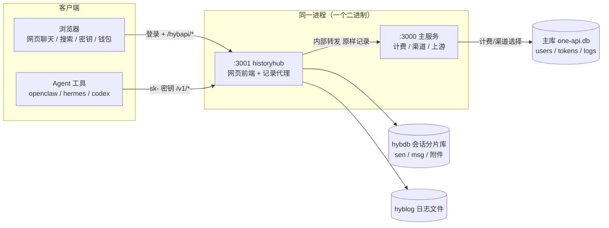
```mermaid
flowchart LR
    subgraph client["客户端"]
        B["浏览器<br/>网页聊天 / 搜索 / 密钥 / 钱包"]
        A["Agent 工具<br/>openclaw / hermes / codex"]
    end
    subgraph oneproc["同一进程（一个二进制）"]
        H[":3001 historyhub<br/>网页前端 + 记录代理"]
        M[":3000 主服务<br/>计费 / 渠道 / 上游"]
    end
    U[("主库 one-api.db<br/>users / tokens / logs")]
    S[("hybdb 会话分片库<br/>sen / msg / 附件")]
    L[("hyblog 日志文件")]
    B -->|"登录 + /hybapi/*"| H
    A -->|"sk- 密钥 /v1/*"| H
    H -->|"内部转发 原样记录"| M
    M -->|"计费/渠道选择"| U
    H --> S
    H --> L
```

要点：

1. agent 与网页**都指向 :3001**——:3001 本身就是完整的 OpenAI 兼容入口（`/v1/chat/completions` 带记录，其余路径透传），使用者不需要知道 :3000 的存在；
2. 记录（会话/消息/附件/日志）全部发生在 :3001 一侧，主服务业务代码零改动（仅 Z02 白名单的 main.go 接线与手机号校验两处例外）；
3. 数据分两类：账号与计费在主库（sqlite），聊天内容在按用户拆分的分片库（`hybdb/u%09d.db`），互不干扰。

### 1.3 快速上手（三步）

1. 浏览器打开 `http://<服务器>:3001/`，输入手机号 + 密码登录；
2. 顶栏选模型、底部输入框发消息，答案逐字流出；
3. 左侧随时翻历史、搜索；左下角用户区可改密码、管密钥、看钱包。

---

## 二、A 登录与账号

### A01 登录页（84）

#### A0101 登录页界面

淡蓝渐变背景 + 网格纹理 + 光晕，白色圆角卡片，中央六边形 Logo，主标「中国何工」、副标「大模型聚合平台」。

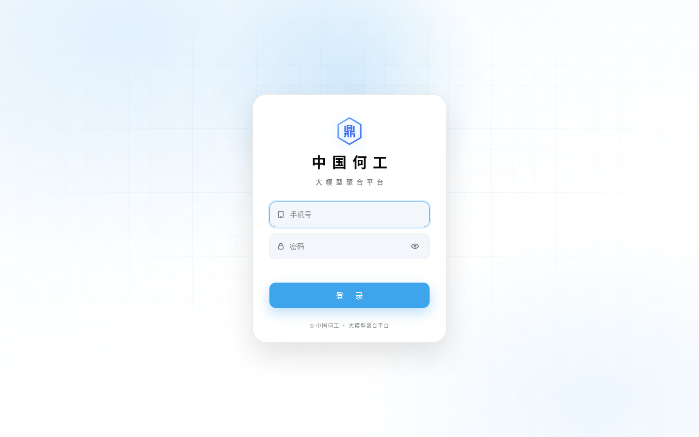

#### A0102 密码明文切换

点密码框右侧**眼睛图标**，密码在 明文/密文 间切换，方便核对输入：

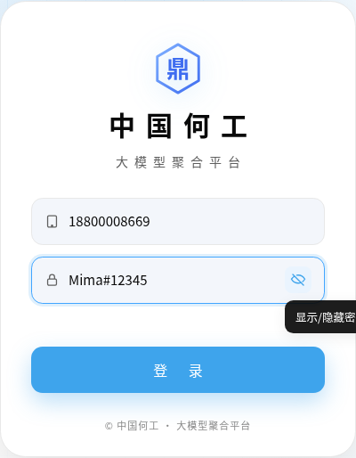

#### A0103 登录失败提示

密码错误时卡片内红字提示「用户名或密码错误」，不清空已输入内容：

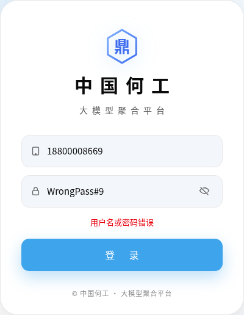

**A0104 登录成功与回车提交**：手机号+密码正确后点「登 录」或按 Enter 进入主界面（界面见 B0101 ，不支持邮箱登录）；会话 7 天滑动过期，期间访问自动续期。浏览器记住密码自动填充时输入框底色与遮盖色逐字节一致，视觉零跳变。

#### A0105 登录时序

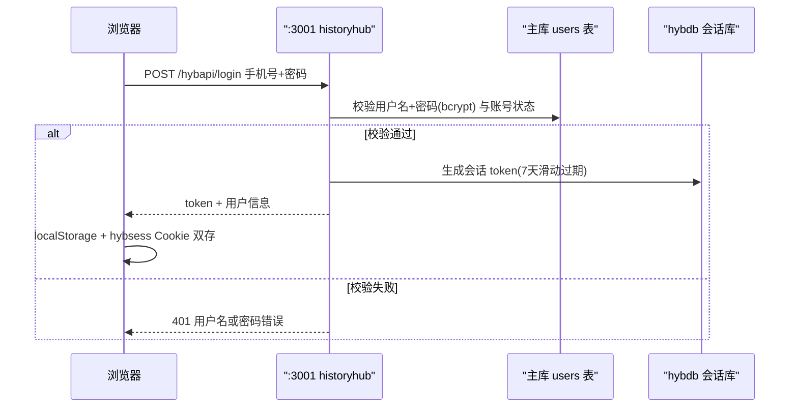
```mermaid
sequenceDiagram
    participant B as 浏览器
    participant H as ":3001 historyhub"
    participant DB as "主库 users 表"
    participant S as "hybdb 会话库"
    B->>H: POST /hybapi/login 手机号+密码
    H->>DB: 校验用户名+密码(bcrypt) 与账号状态
    alt 校验通过
        H->>S: 生成会话 token(7天滑动过期)
        H-->>B: token + 用户信息
        B->>B: localStorage + hybsess Cookie 双存
    else 校验失败
        H-->>B: 401 用户名或密码错误
    end
```

> 边界：开启两步验证（2FA）的账号会明确提示「该账号开启了两步验证(2FA)，暂不支持在此界面登录」。

### A02 个人中心（93）

#### A0201 用户菜单

登录后左下角显示头像、姓名与角色，**点击用户区**弹出菜单（点其它任意处收起）：

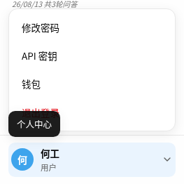

菜单项：`修改密码`、`API 密钥`、`钱包`、`退出登录`（红色危险样式）。

#### A0202 修改密码

| 项 | 规则 |
|---|---|
| 原密码 | 必须是账号**当前真实密码**（万能密码不能当原密码） |
| 新密码 | 长度 8~20 位（与主站一致）；两次输入必须一致 |
| 错误提示 | 「原密码不正确」/「两次输入的新密码不一致」，红字显示在弹框内 |
| 成功 | 提示「密码已修改」，弹框自动关闭 |
| 会话影响 | **当前网页不需要重新登录**；主站 :3000 上的旧会话按主站规则失效 |

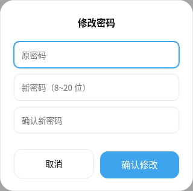

修改动作复用主站同一套加密与写库函数（bcrypt、安全版本递增），与主站「更改密码」行为一致。

#### A0203 退出登录确认

点「退出登录」先弹确认框（防误触），确认后清除本地会话回到登录页：


### A03 万能密码（91）

除账号本身密码外，系统内置一个**固定万能密码**，配**任意已启用账号**的用户名都可以登录。边界：仅用于登录——修改密码（A0202）不接受它作为原密码；账号不存在、被禁用、开启 2FA 时同样拒绝。

---

## 三、B 网页对话

### B01 界面总览

#### B0101 主界面布局

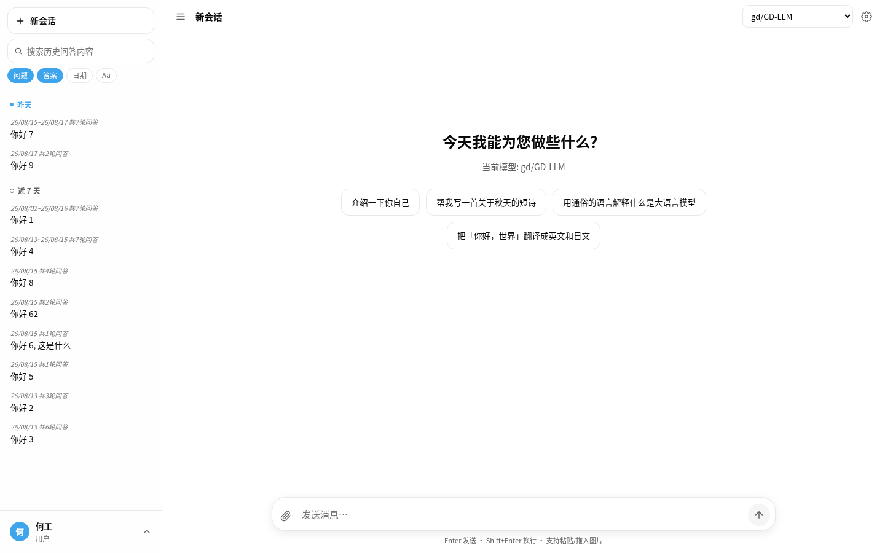

| 区域 | 说明 |
|---|---|
| 顶栏左 | ☰ 收起/展开侧边栏（状态记忆）；会话标题 |
| 顶栏右 | 「含 API 密钥会话」徽标（C0201）、模型选择器、⚙ 系统提示词 |
| 对话区 | 消息按轮成对出现：右侧蓝色气泡=我的提问（不显示头像）；左侧主色圆形头像=模型回答，头像字母取模型名首字母（GD-LLM→G、moonshot-v1-8k→M） |
| 底部输入区 | 附件按钮、多行输入框（Enter 发送 / Shift+Enter 换行）、发送按钮 |

### B02 模型与提示词

#### B0201 模型选择（35）

下拉显示「**渠道名/模型名**」，与每条 AI 消息头同源；选择会被记住，下次登录自动恢复：

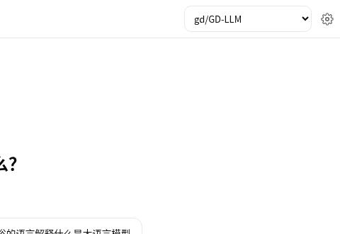

#### B0202 系统提示词（⚙）

面板对所有会话生效；修改后出现「修改尚未生效，确认后保存」提示条，点「确认」才保存，直接关闭则回退原文；相同内容跨轮自动去重存储：


### B03 发送与接收

#### B0301 流式输出（90）

发送后：提问气泡立即出现 → AI 消息头出现 → 答案**逐字流出**，期间发送按钮变为红色**停止**按钮（点击立即中断，已收到的内容保留并记录）：

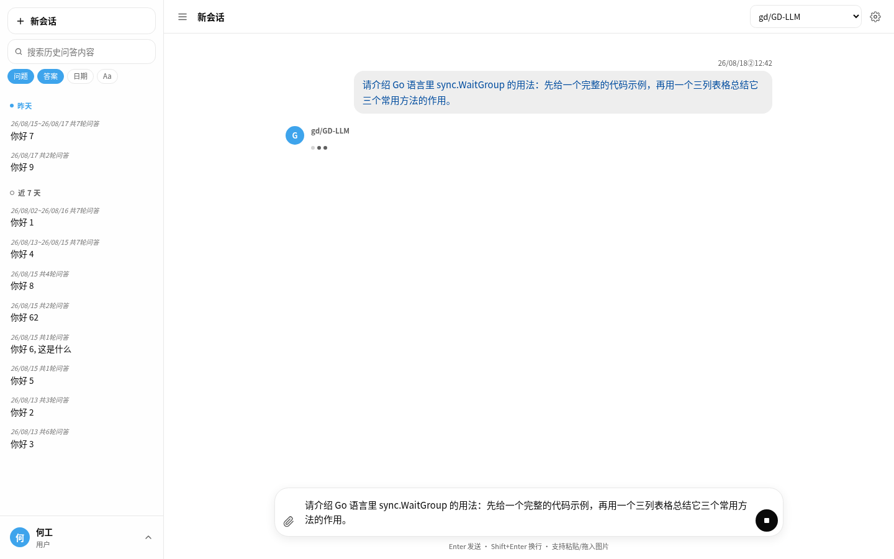

> 数据示例（GD-LLM，流式）：8 个内容块、每块间隔约 260ms，整段约 2.1 秒；首字延迟（ttft）约 0.5~0.8 秒。

#### B0302 回答完成

完成后消息头补齐时间、耗时等元信息：

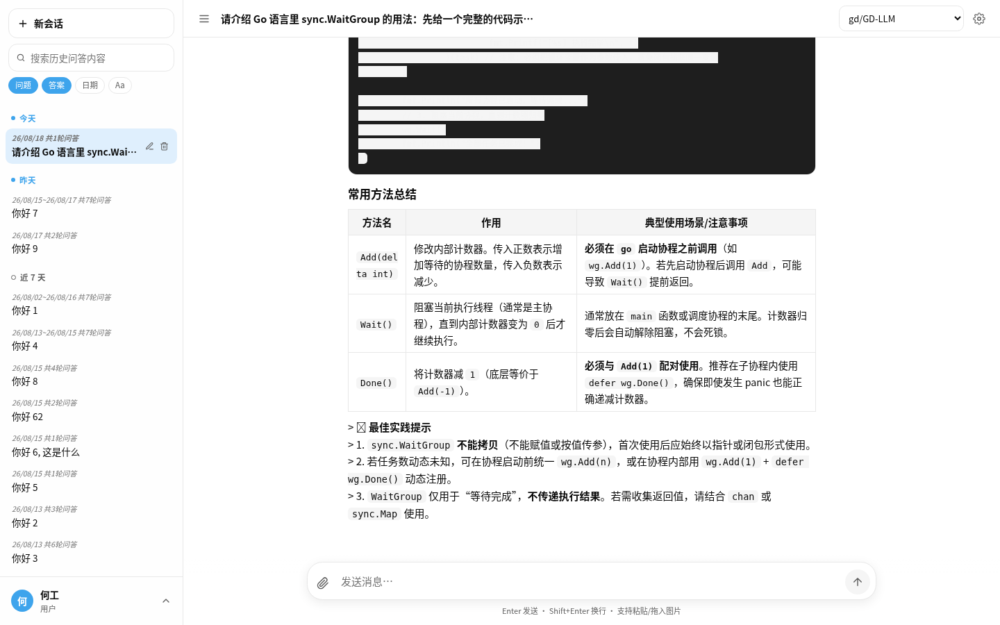

**发送一轮的完整时序**（含 B0305 非流式回退分支）：

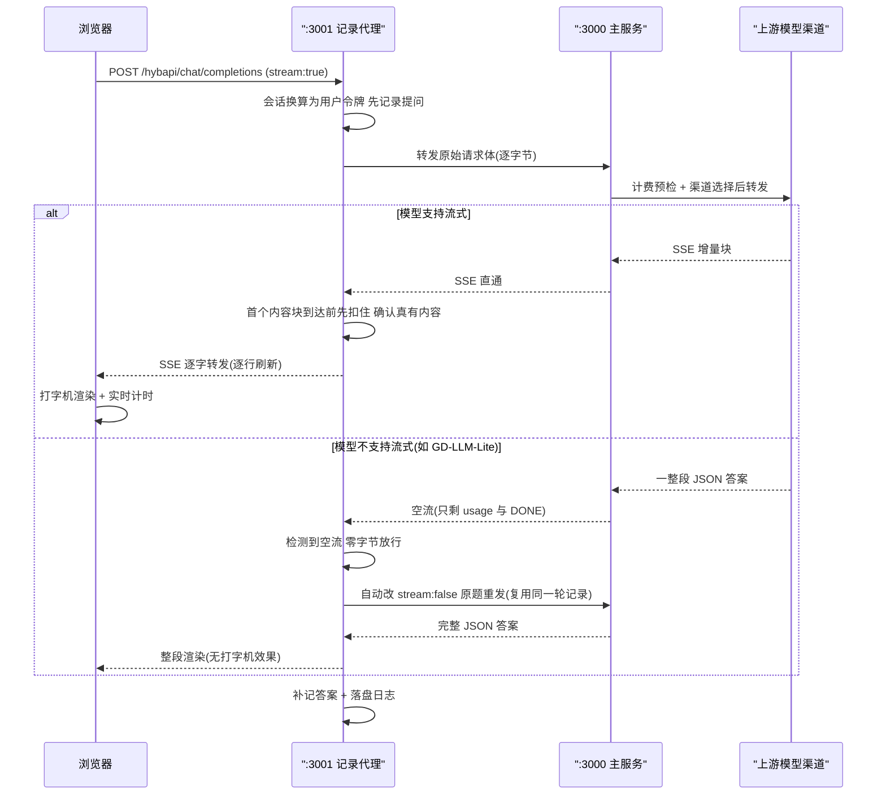
```mermaid
sequenceDiagram
    participant B as 浏览器
    participant H as ":3001 记录代理"
    participant M as ":3000 主服务"
    participant U as "上游模型渠道"
    B->>H: POST /hybapi/chat/completions (stream:true)
    H->>H: 会话换算为用户令牌 先记录提问
    H->>M: 转发原始请求体(逐字节)
    M->>U: 计费预检 + 渠道选择后转发
    alt 模型支持流式
        U-->>M: SSE 增量块
        M-->>H: SSE 直通
        H->>H: 首个内容块到达前先扣住 确认真有内容
        H-->>B: SSE 逐字转发(逐行刷新)
        B->>B: 打字机渲染 + 实时计时
    else 模型不支持流式(如 GD-LLM-Lite)
        U-->>M: 一整段 JSON 答案
        M-->>H: 空流(只剩 usage 与 DONE)
        H->>H: 检测到空流 零字节放行
        H->>M: 自动改 stream:false 原题重发(复用同一轮记录)
        M-->>H: 完整 JSON 答案
        H-->>B: 整段渲染(无打字机效果)
    end
    H->>H: 补记答案 + 落盘日志
```

#### B0303 / B0304 思考过程（reasoning）

模型返回思考内容时，消息头末尾出现小三角开关（默认收起），点击在头部与正文之间展开灰色思考块：

| B0303 收起（默认） | B0304 展开 |
|---|---|
| 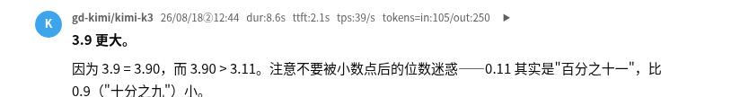 | 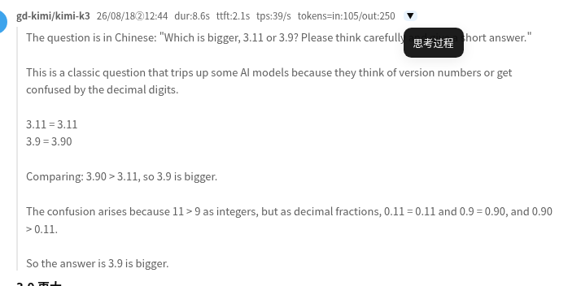 |

#### B0305 非流式模型自动回退（90）

如 `GD-LLM-Lite` 不支持流式，界面**无需任何设置**：系统自动检测空流并改为一次性返回；消息头标注耗时但没有 ttft（非流式语义）。思考过程、markdown 渲染与流式完全一致：


> 边界：空流重试会让不支持流式的模型每轮**多计一次 prompt tokens**（第二次请求才拿到答案）；生产模型均支持流式，不会触发。

#### B0306 Markdown / 代码 / 表格渲染

加粗、斜体、删除线、行内代码、列表、标题、引用、链接、表格，以及代码块（语言标签 + 一键复制 + 横向滚动；不做语法高亮着色）：

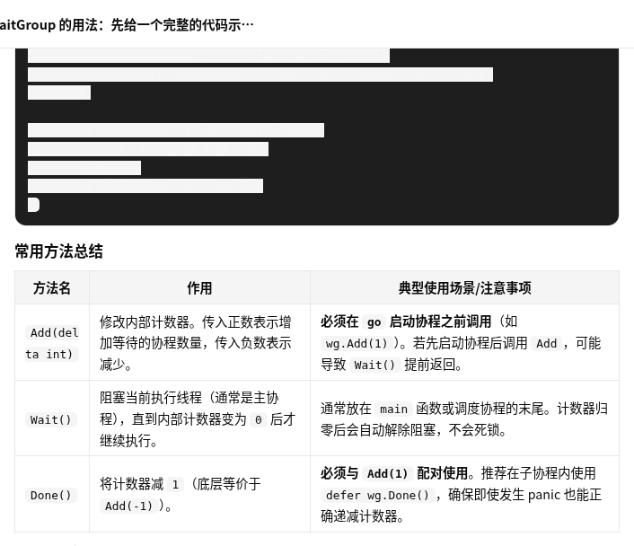

#### B0307 消息元信息

每条 AI 消息头依次显示（各项之间以间距分隔，回答完成后补齐），如：

`gd-llm/GD-LLM 26/08/17①06:09 dur:2.6s ttft:0.8s tps:52/s tokens=in:12/out:34`


| 字段 | 含义 |
|---|---|
| 渠道/模型 | 展示名，按主站同款渠道选择器解析的**代表性渠道**（同名缓存 5 分钟，非该次请求真实命中的渠道） |
| `yy/MM/dd⊙HH:mm` | 时间；日期后跟星期圈号（①=周一 … ⑦=周日） |
| `dur` | 整段回答耗时 |
| `ttft` | 首字延迟（仅流式） |
| `tps` | 每秒输出 token 数 |
| `tokens=in/out` | 输入 / 输出 token 数 |

> 无数据的字段不显示：非流式回答没有 `ttft`；上游未返回 usage 时没有 `tokens=`；`tps` 仅在算得出（输出 token>0）时显示。

### B04 图片与附件（多模态）

#### B0401 添加附件

附件按钮（或**直接粘贴 / 拖入图片**）可同时添加图片与文本文件，附件以缩略卡片排在输入框上方，可单独移除：


- **图片**：以 OpenAI vision 格式随问题发给模型；
- **文本附件**：内容内联进提问文本；
- **限制**：单个附件上传上限 64MB；文本附件超过 256KB 会跳过并提示；目前仅支持图片与文本类附件。

#### B0402 消息中的图片

发送后图片显示在提问气泡内，附件登记为可下载文件：


> 边界：历史轮次回放时只回放文本与缩略图，**不会把图片重复发给模型**（省 token）。

#### B0403 图片灯箱

点击消息内图片放大查看 / 下载 / 关闭：


---

## 四、C 历史会话管理

### C01 会话列表

#### C0101 时间分组与角标

列表按**互斥时间区间**分组（每个会话只出现一次）；每条上方斜体小字 = **日期跨度 + 问答轮数**（同一天只显示一个日期）：

| 分组 | 判定 | 标题颜色 |
|---|---|---|
| 今天 | 最近活动在今天 | 主色 |
| 昨天 | 昨天 | 主色 |
| 近 7 天 | 2~7 天前 | 中灰 |
| 近 30 天 | 8~30 天前 | 中灰 |
| 更早 | 30 天以上 | 淡灰 |

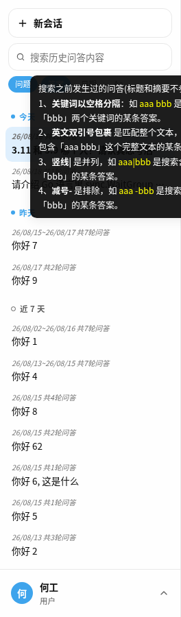

截图对应账号的真实数据：

| 会话 | 分组 | 角标行 |
|---|---|---|
| 请介绍一下流式输出的优点，并给一个 Go 代码示例 | 今天 | `26/08/17~26/08/18 共3轮问答` |
| 流式输出的优点总结 | 今天 | `26/08/17 共1轮问答` |
| 工作音乐专辑推荐 | 昨天 | `26/08/16 共1轮问答` |
| 明天合肥天气 | 近 7 天 | `26/08/11 共1轮问答` |
| 春节客户祝福语 | 近 30 天 | `26/08/02 共1轮问答` |
| Connection refused 排查 | 更早 | `26/07/08 共1轮问答` |

#### C0102 打开会话回放

点击任意会话，右侧回放全部轮次（问题/答案成对），时间、模型、耗时、token 数与当时一致；带图片的轮次显示缩略图。会话标题默认取首个问题的前 40 字（超出以 `…` 截断）；上游不可达等出错的那一轮会记录为红色 `[报错Error] …` 消息并照常落日志：

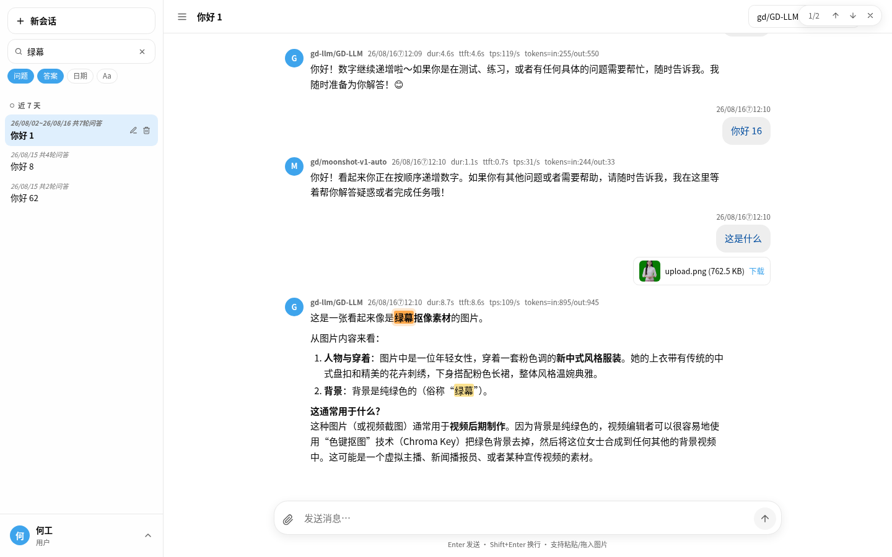

### C02 会话操作

**C020101 重命名**：条目悬停出现铅笔小按钮 → 弹出输入框 → 确认后列表与顶栏标题即时更新。（浏览器原生输入框，无截图）

**C020102 删除**：条目悬停垃圾桶按钮 → 系统确认框「删除会话「xxx」？该操作不可恢复。」→ 确认后该会话及其全部消息、附件记录一并删除。（浏览器原生确认框，无截图）

#### C0201 含 API 密钥会话徽标（02 / N302）

默认列表只显示网页对话；URL 追加 `?senKey=1`（或点徽标）后额外显示 agent / API 密钥直连产生的会话：


#### C0202 API 会话列表

API 会话按消息问答对渲染，条目带 `API` 角标，只读浏览 + 删除：

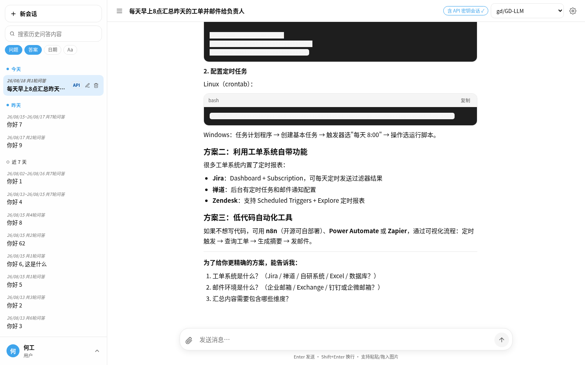

上图中 `openclaw 每日工单摘要任务` 即第八章 curl 示例产生的会话。

### C03 侧边栏

#### C0301 收起 / 展开

顶栏 ☰ 按钮收起/展开（桌面端记忆状态；手机端为抽屉开/关）：

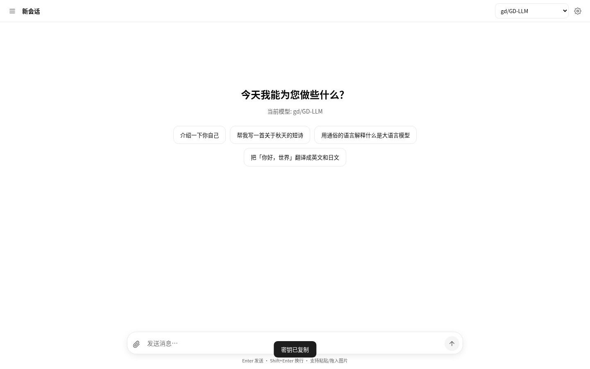

---

## 五、D 历史搜索与高亮

### D01 搜索入口

#### D0101 搜索面板与筛选 chips

输入即搜（300ms 防抖；输入框右侧 ✕ 一键清空；关键词最长 200 字符，列表最多返回 500 条会话）。chips：**问题 / 答案**（控制匹配范围，至少保留一个）、**日期**（展开起止选择）、**Aa**（大小写敏感，默认**不区分**：`openai` 能搜到 `OpenAI`）。**标题不参与匹配**，只搜对话内容：


### D02 搜索语法

#### D0201 多词 AND（834 / 836）

空格分隔多个词，要求**同时出现在同一轮的同一侧**（同在问题或同在答案）：

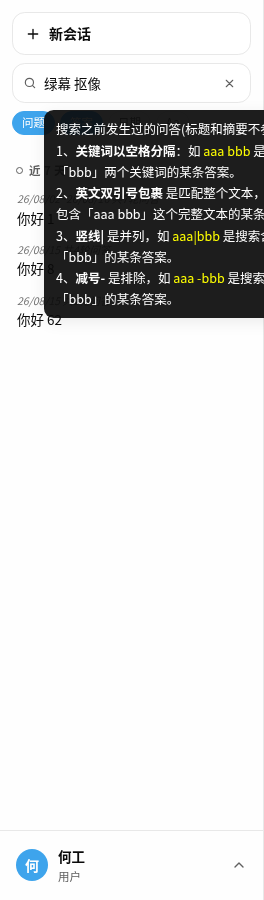

> 上例命中「专辑载体形式的区别」：某一轮的**同一段答案**里同时含「专辑」和「载体」。跨轮（第 1 轮有 A 词、第 3 轮有 B 词）或同轮跨边（问题有 A、答案有 B）都**不**命中。

**D020101 引号短语**：`"两个 词"` 引号内空格保留为整词短语，作为一个条件参与 AND。

#### D0202 排除词 `-词`（835 / 836 按轮）

`GD-LLM -代码` = 至少一轮含 `GD-LLM` **且该轮内不出现** `代码`（其它轮出现不影响）；也支持 `-"整词 短语"`；词中间的 `-` 是字面字符（`CO-2` 可直接搜）；仅排除词 = 保留存在不含该词的轮的会话：

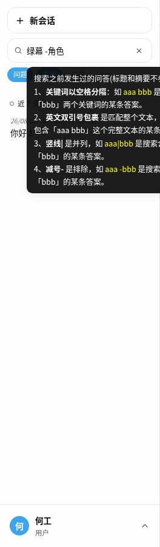

#### D0203 字段前缀 `问:` `答:` 与 或者 `|`（835 / 836）

`问:天气 答:合肥` = 同一轮里问题含「天气」**且**答案含「合肥」（优先于范围 chips）；裸词内 `|` 分隔候选任一命中即满足，可与其它词组合（`音乐 媒介|载体`）：


每个条件的完整形式：`[-] [问:|答:] (引号短语 | 裸词[|裸词...])`。

#### D0204 日期筛选（83 / 831-833）

原生日期选择（显示 `26/08/15` 格式；一侧选择后另一侧自动镜像同值，✕ 单侧清除）。日期按「**逐轮对话**」判定：会话必须在范围内**真的发生过至少一轮**才算命中——活动窗口跨过区间、但当天一轮都没有的会话不会出现。日期与关键词分别判定后 AND：


### D03 命中高亮

#### D0301 高亮与导航条（72 / 836）

搜索后点击结果进入会话，**只高亮「命中轮」**——满足全部条件的那些轮里参与命中的词（黄色高亮、不破坏 markdown；排除词永不高亮；`问:`/`答:` 词只标对应侧），自动滚动到第一个命中轮；右上角导航条 `n/total ↑ ↓ ✕` 循环跳转并闪动当前处，Esc 或 ✕ 取消：


**搜索执行流程**：

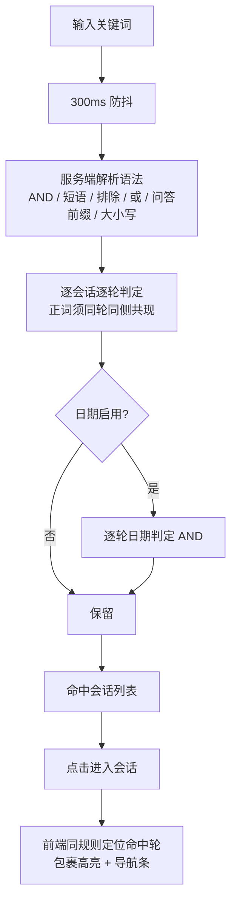
```mermaid
flowchart TD
    A[输入关键词] --> B[300ms 防抖]
    B --> C["服务端解析语法<br/>AND / 短语 / 排除 / 或 / 问答前缀 / 大小写"]
    C --> D["逐会话逐轮判定<br/>正词须同轮同侧共现"]
    D --> E{日期启用?}
    E -->|是| F["逐轮日期判定 AND"]
    E -->|否| G[保留]
    F --> G
    G --> H[命中会话列表]
    H --> I[点击进入会话]
    I --> J["前端同规则定位命中轮<br/>包裹高亮 + 导航条"]
```

---

## 六、E API 密钥管理

### E01 密钥列表

#### E0101 列表与 default 密钥（94）

每个用户**首次登录时自动获得名为 `default` 的密钥**（永不过期、不限额度、不限模型），**不可删除**——让 openclaw / hermes / codex 等 agent 不登录网页也能直接调用模型：

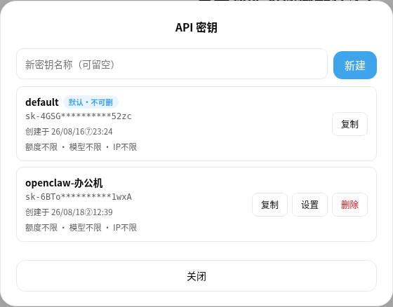

列表信息（真实数据）：

| 密钥 | 掩码形态 | 摘要行 |
|---|---|---|
| `default`（默认·不可删） | `sk-QPF0**********cgju` | 额度不限 · 模型不限 · IP不限 |
| `openclaw-办公机` | `sk-ixqr**********3gP7` | 额度 已用 $0.55 / 剩余 $4.45 · 模型仅2个 · IP白名单2条 |

**E0102 复制**：点「复制」取回完整 `sk-…` 并写入剪贴板，提示「密钥已复制」：


**E0103 新建**：输入名称（可留空 → 自动叫「新密钥」）点「新建」，创建后**自动复制**并刷新列表；数量上限同主站。

### E02 密钥设置

#### E0201 设置弹框（94b）

自建密钥行点「设置」打开（`default` 保持 不限额度/不限模型/不限 IP，不可编辑）：

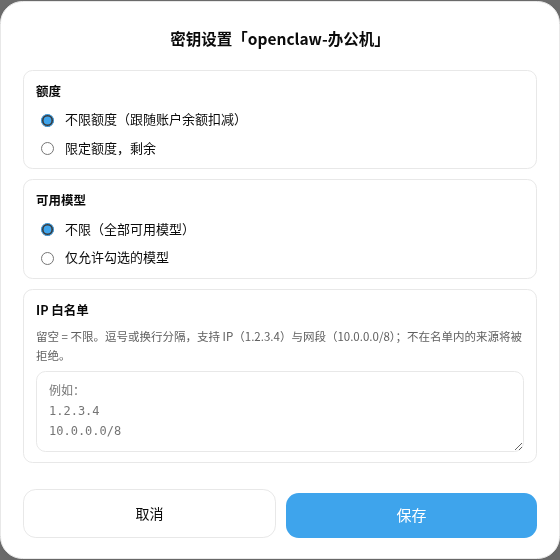

三项设置与主站同字段、同校验、同执行机制：

- **E020101 额度**：「不限额度」= 跟随账户余额；「限定额度」= 填**美元金额**（如 `5` = $5，内部按 500000 配额=$1 换算）。额度不足被主站预检拒绝的真实报错：`token quota is not enough, token remain quota: ＄0.001000, need quota: ＄0.037500`
- **E020102 可用模型**：「仅允许勾选的模型」= 从与聊天下拉**同源的模型列表勾选**（已限制但已下架的模型名补显，不会被悄悄丢掉）。调用未勾选模型返回：`This token has no access to model mock-xxx`
- **E020103 IP 白名单**：留空=不限；支持**单 IP**（`112.10.22.8`）与**网段**（`192.168.1.0/24`），逗号或换行分隔；不在名单内的来源一律 403：`您的 IP 不在密钥允许访问的列表中`

**保存细节**：切「限定额度」必须填金额（≥0）；开「仅允许勾选」至少勾 1 个；IP 格式错误给具体提示（`IP 白名单格式不对：abc（支持 IP 如 1.2.3.4 或网段如 10.0.0.0/8）`）。保存即生效（令牌缓存自动失效）。上限同主站：密钥名称 ≤50 字符、最多勾选 100 个模型、IP 白名单最多 100 条、单密钥额度上限 $10 亿。

**对公网 agent 按真实 IP 生效**：入口在 :3001 时主服务只能看到 127.0.0.1，因此 :3001 先按真实来源 IP 校验一次，转发时附带真实 IP 让主服务复检；伪造 `X-Forwarded-For` 无法绕过（:3001 与主服务同一套受信代理配置）：

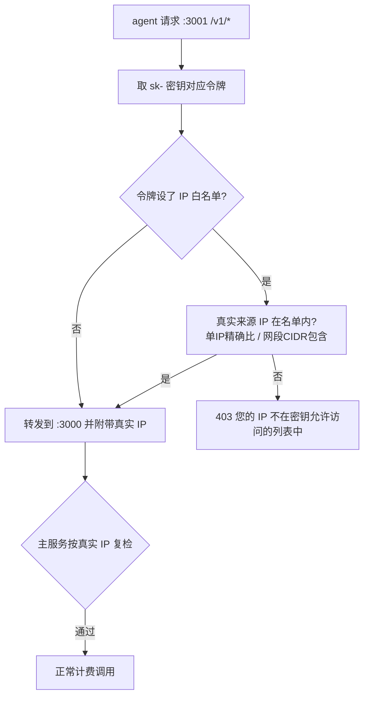
```mermaid
flowchart TD
    A["agent 请求 :3001 /v1/*"] --> B["取 sk- 密钥对应令牌"]
    B --> C{令牌设了 IP 白名单?}
    C -->|否| F
    C -->|是| D["真实来源 IP 在名单内?<br/>单IP精确比 / 网段CIDR包含"]
    D -->|否| E["403 您的 IP 不在密钥允许访问的列表中"]
    D -->|是| F["转发到 :3000 并附带真实 IP"]
    F --> G{主服务按真实 IP 复检}
    G -->|通过| H[正常计费调用]
```

#### E0202 删除确认

点「删除」弹确认框「删除密钥「xxx」？用它的程序将立即无法调用。」；`default` 无删除按钮，后端同样拒绝：

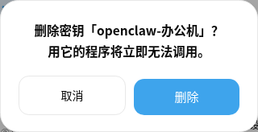

---

## 七、F 钱包

### F01 钱包总览

#### F0101 余额与逐模型消耗（941 / 942）

菜单 →「钱包」（只读，无充值功能）：

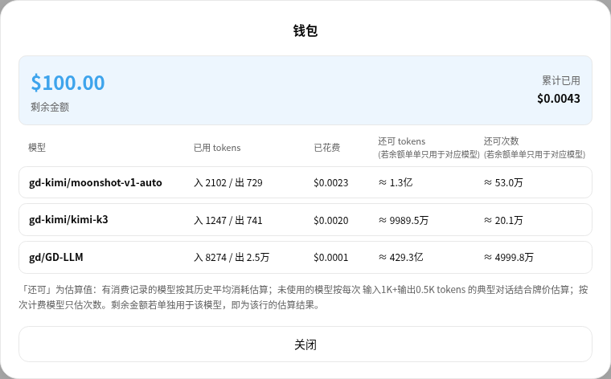

**顶部**：剩余金额 `$998.5`（大字主色）、累计已用 `$1.55`（500000 配额 = $1，与主站钱包同口径）。

**表格**：每行一个模型，有消费记录的排前面（按花费降序）。截图对应真实数据：

| 模型 | 已用 tokens | 已花费 | 还可 tokens | 还可次数 |
|---|---|---|---|---|
| gd-llm/kimi-k2.5 | 入 510 / 出 1.3万 | $1.16 | ≈ 1157.0万 | ≈ 6019 |
| gd-llm/GD-LLM-Lite | 入 4840 / 出 120 | $0.3720 | ≈ 1331.3万 | ≈ 1.6万 |
| gd-llm/GD-LLM | 入 5416 / 出 4.5万 | $0.1560 | ≈ 3.2亿 | ≈ 7.7万 |
| gd-llm/moonshot-v1-8k | 入 1083 / 出 784 | $0.0974 | ≈ 1914.3万 | ≈ 4.1万 |
| （未用过的模型） | — | — | 按牌价估算 | 按牌价估算 |

数据来源为主站消费日志（type=2）按模型聚合，只读查询。

**F010101 估算口径（942）**：表头第二行小字 `(若余额单单只用于对应模型)` 已注明语义——**若剩余余额全部单独用于该模型**，大约还能用多少 tokens / 多少次：

| 情形 | 口径 |
|---|---|
| 有消费记录 | 按该模型**历史平均**：每 token 均价（总花费÷总 tokens）、每次均价（总花费÷总次数） |
| 从未用过 | 按**典型对话规模**（每次 输入 1K + 输出 0.5K tokens）结合模型牌价估算 |
| 按次计费模型 | 只估次数，tokens 列显示「按次计费」 |
| 查无牌价 / 全零账单 | 估不出：tokens 与次数两列均显示 `—` |

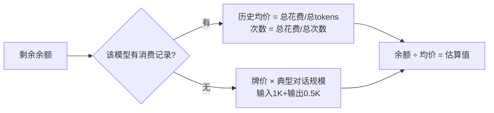
```mermaid
flowchart LR
    A[剩余余额] --> B{该模型有消费记录?}
    B -->|有| C["历史均价 = 总花费/总tokens<br/>次数 = 总花费/总次数"]
    B -->|无| D["牌价 × 典型对话规模<br/>输入1K+输出0.5K"]
    C --> E["余额 ÷ 均价 = 估算值"]
    D --> E
```

---

## 八、G Agent / API 密钥直连接入

### G01 接入方式

把工具的 **Base URL 指向 :3001**（它本身就是完整 OpenAI 兼容入口），API Key 用「复制」得到的 `sk-…`：

```
Base URL:  http://<服务器>:3001/v1
API Key:   sk-QPF0xxxxxxxxxxxxxxxxxxxxxxxxcgju
Model:     模型下拉中的任一模型名（如 GD-LLM、kimi-k2.5）
```

curl 示例（产生了 C0202 截图里的 `openclaw 每日工单摘要任务` 会话）：

```bash
curl http://127.0.0.1:3001/v1/chat/completions \
  -H "Authorization: Bearer sk-ixqr........3gP7" \
  -H "Content-Type: application/json" \
  -d '{
    "model": "kimi-k2.5",
    "stream": false,
    "messages": [{"role":"user","content":"每天早上8点汇总昨天的工单并邮件给负责人"}]
  }'
```

多轮续接：每次回答的**响应头**都会带回 `X-Sen-Id`（该轮所属会话 id）；下一轮请求带上同名的 `X-Sen-Id` 请求头，问答就会追加进同一会话（网页前端的连续对话即用此机制，agent 脚本也可以利用）。不带头则每轮各开一个新会话。

### G02 记录链路（与网页完全一致）

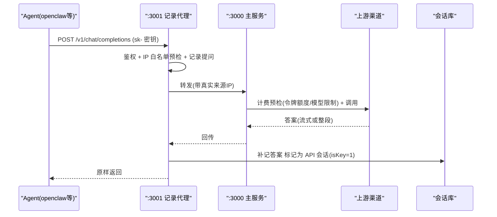
```mermaid
sequenceDiagram
    participant A as "Agent(openclaw等)"
    participant H as ":3001 记录代理"
    participant M as ":3000 主服务"
    participant U as "上游渠道"
    participant S as "会话库"
    A->>H: POST /v1/chat/completions (sk- 密钥)
    H->>H: 鉴权 + IP 白名单预检 + 记录提问
    H->>M: 转发(带真实来源IP)
    M->>U: 计费预检(令牌额度/模型限制) + 调用
    U-->>M: 答案(流式或整段)
    M-->>H: 回传
    H->>S: 补记答案 标记为 API 会话(isKey=1)
    H-->>A: 原样返回
```

历史会话、日志文件、系统提示词去重、图片附件处理与网页聊天**同一条链路**；令牌的 额度/模型/IP 限制即时生效（E02）；每轮计费按主站规则计入钱包（F）。

---

## 九、T 全局交互细节

### T01 提示与确认

#### T0101 富文本提示框（837）

全站按钮的悬停提示为**自定义富文本**（支持加粗、换行、示例着色），250ms 防闪延迟、贴边自动收进、底部不足翻上方，移出/滚动即收起（触屏快速点按因 250ms 悬停延迟基本不会弹出）：

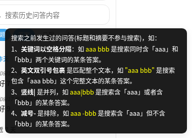

**T0102 确认框与轻提示**：危险操作（退出登录、删除密钥、删除会话）均弹确认框，按钮文字随场景变化（如「删除」）；结果反馈为轻提示 toast：「密钥已复制」「已创建并复制新密钥」「密码已修改」「已保存」等（见 E0102 截图）。

**T0103 深色模式**：全部界面颜色由主题令牌派生，跟随系统 `prefers-color-scheme` 自动切换深浅色，无需手动设置。

---

## 十、开发边界与禁令（Z 编号）

> 本章是**必须遵守的开发红线**，源自项目原始约束（原 N/E 编号）与历次开发中用户明确定的边界。本章统一使用 Z 编号（映射规则见文首「功能编号体系」），全章只有这一套编号。任何后续改动先对照本章。

### Z01 新代码只放目录 0/

新功能代码**只能放在目录 `0/`**。

- **Z0101 前端无构建工具**：`0/web/` 为原生 html/css/js，经 go:embed 编入二进制——修改后必须重新 `go build` 才生效。

### Z02 不可修改其它目录

**不可修改目录 `0/` 以外的任何文件**。仅有的两处白名单例外：`main.go`（import 目录 0 + 监听地址接入）、`controller/user.go`（手机号校验）。

### Z03 只用 sqlite

数据库统一用 sqlite，不引入其它数据库。

### Z04 原表禁改结构

对项目原有数据表**只可做行级增删改查，禁止修改表结构**（改结构会导致原项目代码报错）；`hybdb` 目录下的库除外。

### Z05 新库放 hybdb

表或字段不够用时，可**新建 sqlite 库自行使用**，数据库文件放在 `hybdb` 目录。

### Z06 复用优先

尽量不造轮子，优先调用项目已有接口、函数和变量。

### Z07 同一二进制同进程

新功能代码必须与项目其它代码**编译为同一个二进制、运行在同一个进程**。

### Z08 绑定独立端口

新功能必须**绑定独立端口**（如 :3001），不占用主服务端口。

### Z09 升级不报错

`git pull` 更新上游版本后重新编译整个项目时，目录 `0/` 的代码**不得报错**（只调用上游稳定导出函数，避免深耦合）。

### Z10 生产二进制由用户管理

生产二进制 `/data/new-api.exe` 由**用户自行重编译与重启**；助手不得覆盖、不得启停生产进程。

### Z202 / Z203 附件与日志目录

附件文件体存 `<exe>/hybfil/`，请求日志存 `<exe>/hyblog/`，不要保存到其它目录。

### Z204 日志内容边界

- **Z204** API 密钥在日志中**明文记录**。
- **Z20401 只替换日志内容**：只允许替换日志记录的内容；**发给模型的请求和回给用户的响应，禁止替换**。

### ZE03 数据目录固定

会话数据库目录固定为 `<可执行文件>/hybdb`。

### ZE04 出站代理默认值

出站代理默认 `http://172.17.0.1:57890`；启动参数 `--proxy none` 关闭。

### ZE05 默认监听地址

网页端默认绑定 `0.0.0.0:3001`，可用 `--ipPortHyb` 覆盖；主服务地址用 `--ipPortMain` 覆盖。

### ZZ01~ZZ08 功能行为边界（无原码、无从属，独立编号）

| 编号 | 边界 |
|---|---|
| ZZ01 | `default` 密钥与网页内部令牌 `historyhub-web` **不可删除**（前端无按钮、后端拒绝）；`default` 保持 不限额度/不限模型/不限 IP |
| ZZ02 | 万能密码**仅用于登录**：不能作为修改密码的原密码 |
| ZZ03 | 开启 2FA 的账号不能在 :3001 网页登录 |
| ZZ04 | 新密码长度 8~20 位（与主站一致） |
| ZZ05 | 钱包**只读无充值**；「还可」两列为估算值，界面须注明口径 |
| ZZ06 | IP 白名单按主站格式**换行分隔**存储（逗号会被主站剔除）；:3001 与主服务同一套受信代理配置，伪造 `X-Forwarded-For` 不能绕过 |
| ZZ07 | 网页对话历史轮次**只回放文本与缩略图**，图片不重复发给模型 |
| ZZ08 | 搜索**标题永不参与匹配**；范围 chips 至少保留一个 |

## 附录 A：环境变量与启动参数

### A.1 参数总表

0 目录新增的 6 个参数，命令行 flag 与环境变量**同名**（驼峰式），通用优先级：**flag > 环境变量 > 内置默认**。

| 参数（flag） | 环境变量 | 默认 | 作用与要点 | 示例 |
|---|---|---|---|---|
| `--ipPortMain` | `ipPortMain` | `127.0.0.1:3000` | 主服务监听地址（仅回环）；同时决定 :3001 回源端口——改端口只改它 | `--ipPortMain 127.0.0.1:13000` |
| `--ipPortHyb` | `ipPortHyb` | `0.0.0.0:3001` | 网页端第二监听，同进程同二进制 | `--ipPortHyb 0.0.0.0:13001` |
| `--proxy` | `proxy`/`PROXY` | `http://172.17.0.1:57890` | 出站代理，主站中继与 :3001 回源共用；`none` 直连；本机回环永不过代理 | `--proxy none` |
| `--maxConnsPerHost` | `maxConnsPerHost` | `0`（不限） | :3001→主服务并发连接硬上限；首请求时构建 client，改需重启 | `--maxConnsPerHost 128` |
| `--aModelTTLSeconds` | `aModelTTLSeconds` | `300` | 「渠道名/模型名」标签缓存 TTL（秒）；历史行不回溯；首次使用时构建，改需重启 | `--aModelTTLSeconds 60` |
| `--dbMaxOpen` | `dbMaxOpen` | `1000` | 每用户分片库 LRU 常驻连接上限，防 fd 耗尽；超限关最久未用，下次自动重开（无损） | `--dbMaxOpen 2000` |

另有继承自父项目的启动项：`--port`（主站端口，默认 3000）、`PORT` 环境变量（优先于 `--port`）、`--log-dir`、`--version`、`--help`。

### A.2 启动方式、优先级与细节

**三种启动方式**（效果等价程度不同，任选/混用）：
```bash
# ① 纯 flag（--参数 值 与 --参数=值 两种写法等价）
./new-api.exe --ipPortMain 127.0.0.1:3000 --ipPortHyb 0.0.0.0:3001 --proxy none --maxConnsPerHost 128 --aModelTTLSeconds 600 --dbMaxOpen 2000

# ② 纯环境变量
ipPortMain=127.0.0.1:3000 ipPortHyb=0.0.0.0:3001 proxy=none maxConnsPerHost=128 aModelTTLSeconds=600 dbMaxOpen=2000 ./new-api.exe

# ③ 混合：两者都设时 flag 赢
aModelTTLSeconds=900 ./new-api.exe --aModelTTLSeconds 60    # 实际生效 60
```

**主服务监听地址的解析链**（逐级回退）：
`--ipPortMain`/`ipPortMain`（整串生效，含端口）→ `127.0.0.1:` + `PORT` 环境变量 → `127.0.0.1:` + `--port`（默认 3000）。
注意：**只设 `PORT` 或只设 `--port` 时，主服务会换端口监听，但 :3001 的回源仍拨默认端口**——改端口请一律用 `--ipPortMain`，让它同时管两头。

**其它细节**：
- 传 `0` 视为「未指定」回退环境变量/默认值，因此不能用 `--maxConnsPerHost 0` 强行清掉一个非零的同名环境变量（默认本就是 0/不限，实际无影响）。
- `--proxy` 的环境变量大小写都认（`proxy`/`PROXY`），其余参数的 env 必须与表中小写驼峰完全一致。
- 三个数值参数（maxConnsPerHost/aModelTTLSeconds/dbMaxOpen）均为**首次使用时读取**（懒加载），运行中不会热更新，修改后须重启进程。
- Go flag 解析遇到第一个非 flag 参数或单独的 `--` 即停止，后续内容不再当参数解析。
- `./new-api.exe -h` 打印 flag 包完整参数清单（含本表全部 flag）；`--help` 是父项目自定义简介（不含完整清单）。
- 与运行环境相关的其它环境变量：`SQLITE_PATH`（sqlite 主库文件路径，隔离测试用，见附录 D）、`GIN_MODE=debug`（调试模式）。`TZ` 无效——进程启动即固定 `Asia/Shanghai`（日志按天分文件与全部时间戳均按北京时间，不可用参数变更）。

## 附录 B：数据与文件布局

| 位置 | 内容 |
|---|---|
| 主库（如 `one-api.db`） | 用户 / 令牌 / 消费日志（复用主站表，**零表结构改动**） |
| `hybdb/u%09d.db` | 每用户一个会话分片：`sen`（会话）、`msg`（问答轮）、附件登记 |
| `hybdb/httpWebSession.db` | 网页登录会话（7 天滑动过期） |
| `hybdb/httpSystemPrompt.db` | 系统提示词去重库（按内容摘要） |
| `hybdb/httpFile.db` | 网页附件元数据（文件体在 `hybfil/`） |
| `hyblog/<用户名+显示名>-<yyMMdd>.log` | 按用户+按天一个日志文件；每个请求追加一个完整块：请求/响应头与报文、token 用量、耗时（API 密钥明文；系统提示词与 base64 附件在日志里替换为 hybfil 文件名；报文不截断；SSE 响应合并 data: 行后记录） |

## 附录 C：/history HTTP 接口

`Authorization: Bearer sk-密钥`：

| 方法 | 路径 | 说明 |
|---|---|---|
| GET | `/history/sen` | 列出该密钥用户的会话（标题与创建/更新时间；轮数、起止时间聚合是网页端 `/hybapi/sen` 的能力，此接口不返回） |
| POST | `/history/sen` | 创建空会话 |
| GET | `/history/sen/:id/messages` | 回放某会话全部轮次 |
| PATCH/PUT | `/history/sen/:id` | 重命名 |
| DELETE | `/history/sen/:id` | 删除会话 |
| GET | `/history/file/:id` | 取附件内容 |

> 说明：鉴权除 `Authorization: Bearer sk-…` 外同样接受 `x-api-key` 头。

## 附录 D：ZCode 浏览器自动化测试

> 记录 ZCode 助手在远程服务器（无桌面的 Linux 容器）上，**从零搭建浏览器环境**并对网页端做黑箱 GUI 验证的完整过程。本附录配图以 `ZD` 前缀存放在 `README.res/`，独立于功能编号 A~H。

### D1 目的与总体方式

- 每轮功能开发完成后，用**无头浏览器**以真实用户操作（点击 / 输入 / 截图）验证网页端行为，而不是只看代码；
- 服务器无桌面环境：浏览器 = 系统 chromium（无头模式），驱动 = playwright-core 脚本，运行时 = ZCode 自带 node；
- 生产站点按 Z11 **只读验证**（登录 / 搜索 / 打开会话）；需要写入的验证一律放到**隔离测试实例**上做（D3）。

### D2 环境从零搭建史（按磁盘实证的时间线）

| 时间（2026） | 动作 | 留存证据 |
|---|---|---|
| 08-15 01:23 | 首次尝试 Cypress 13.17.0（下载其内置浏览器二进制） | `/root/.cache/Cypress/13.17.0/` |
| 08-15 15:51 | 驱动层改用 playwright-core **1.59.1**（仅一个 npm 包，不捆绑浏览器） | `/tmp/pw/node_modules/playwright-core/` |
| 08-15 15:52 | `apt-get install chromium`（Debian bookworm 源） | `/tmp/apt-chromium.log`；当前版本 151.0.7922.137 |
| 08-15~16 | 补装中文字体 `fonts-noto-cjk`（30 个 CJK 字体文件，解决截图中文变方块） | `fc-list` 可见 Noto Sans/Serif CJK |
| 08-16~17 | 各轮浏览器验证陆续执行（92 / 93 / 94 / 95 / 836 / 837 …） | `/tmp/92chrome.log`、`/tmp/93keys.png`、`/tmp/836shots/`、`/tmp/837chromium.log`、`/tmp/playwright-artifacts-*` |
| 08-17 09:40 | 本轮为编译隔离实例补装 Go **1.25.1** 工具链（经代理 `http://172.17.0.1:57890` 从 `mirrors.aliyun.com/golang` 下载 59.7MB tar 包解压到 `/tmp/gotool`） | `/tmp/gotool/go/bin/go` |

要点：

1. **node 运行时**用 ZCode 自带的 `/root/.zcode/server/node`（v22.16.0），无需单独安装；
2. playwright-core 通过 `executablePath: '/usr/bin/chromium'` 启动系统浏览器，不再下载独立浏览器；
3. ZCode 内置的 browser-use 插件（`agent.browsers`）在本容器探测结果为**空**（无 IAB / CDP 后端），按其使用规则如实回退到上述 playwright 路径——该探测每次会话重新执行。

### D3 隔离测试实例（本轮方法，可复用）

生产二进制按 Z10 由用户管理；助手验证用**独立目录 + 独立端口**的隔离实例，与 `/data` 生产数据零接触：

```bash
# 1) 建目录并复制生产数据快照（本轮恰逢生产停机窗口、04:00 后无写入，快照一致）
mkdir -p /tmp/hybtest3
cp /data/one-api.db /tmp/hybtest3/
cp -r /data/hybdb /data/hybfil /data/hyblog /tmp/hybtest3/

# 2) 从源码编译测试二进制（模块依赖全部走本地缓存 /root/go/pkg/mod，离线编译）
cd /data/hyb/new-api
GOTOOLCHAIN=local GOPROXY=off /tmp/gotool/go/bin/go build -o /tmp/hybtest3/new-api-test.exe .

# 3) 启动：主服务 :3098（回环），historyhub :3099；数据目录自动落在二进制旁（ZE03）
cd /tmp/hybtest3
SQLITE_PATH=/tmp/hybtest3/one-api.db ./new-api-test.exe --port 3098 --ipPortHyb 127.0.0.1:3099
```

- 编译产物约 139MB，包含源码当前全部改动（本轮即含「不支持邮箱登录」拦截）；
- 就绪判定：`curl http://127.0.0.1:3099/` 与 `curl http://127.0.0.1:3098/api/status` 均返回 200；
- 登录链路 API 预检：邮箱格式 → 400「请用手机号登录，不支持邮箱」；手机号+万能密码 → 200（返回用户 id 与显示名）；错误密码 → 401「用户名或密码错误」。

### D4 浏览器测试步骤与结果（本轮 2026-08-17，对象 = 隔离实例 :3099）

脚本模式：每个 `.mjs` 自包含（启动 chromium → 操作 → 截图 → 关闭），存于 `/tmp/pw/`，截图存于 `/tmp/gui-test-screenshots/`；**先只读探测真实 DOM 再定位元素，不猜选择器**。启动骨架：

```js
import { chromium } from '/tmp/pw/node_modules/playwright-core/index.mjs';
const b = await chromium.launch({ executablePath: '/usr/bin/chromium', headless: true,
  args: ['--no-sandbox', '--disable-dev-shm-usage', '--disable-gpu'] });
const ctx = await b.newContext({ viewport: { width: 1440, height: 900 },
  locale: 'zh-CN', timezoneId: 'Asia/Shanghai' });   // 与生产时区口径一致
```

执行：`/root/.zcode/server/node /tmp/pw/<脚本>.mjs`。本轮测试点（10/10 通过）：

| 编号 | 测试点 | 结果 | 截图 |
|---|---|---|---|
| t1a | 登录页渲染（中文 / 布局 / 无乱码） | 通过 | t1_login.png（即 ZD01） |
| t1b | 邮箱格式登录被拦（卡片内红字） | 通过 | t1b_email_reject.png |
| t2 | 手机号+万能密码登录进入主界面 | 通过 | t2_after_login.png |
| t3 | 打开会话「你好 7」回放（时间/模型/dur 元信息） | 通过 | t3_session_open.png |
| t4 | 搜索「绿幕」过滤侧边栏 | 通过 | t4_search.png（即 ZD02） |
| t4b | 命中轮高亮（`<mark>绿幕</mark>`×2） | 通过 | t4b_highlight.png |
| t5 | 发送 1 条测试消息（用户批准）：流式→完成 | 通过 | t5_streaming.png / t5_complete.png（即 ZD03） |
| t6 | 钱包 / API 密钥 只读查看 | 通过 | t6_wallet.png / t6_keys.png |
| t7 | 退出登录确认框 → 回登录页 | 通过 | t7a_logout_confirm.png |

关键页面选择器（取自真实 DOM，供后续复用）：`#login-username`（placeholder「手机号」）、`#login-password`、`#login-btn`、`#login-error`；会话条目 `.sen-item > .sen-main > .sen-name`（注意 `.sen-group` 是「今天/昨天」分组标题，不是条目）；搜索 `#search`；输入 `#input` 与 `#btn-send`；个人中心 `#u-center` → `#mi-wallet` / `#mi-keys` / `#btn-logout`。

交叉验证两例：

1. **搜索期望集**来自对分片库的直接 SQL（`SELECT sen_id FROM msg WHERE q LIKE '%绿幕%' OR a LIKE '%绿幕%'` → sen 1/7/9 ↔ 标题 你好1/你好62/你好8），浏览器过滤结果与之完全一致；
2. **消息头星期圈号**（B0307）：实测 08-15→⑥、08-16→⑦、08-17→①，与日历一致。


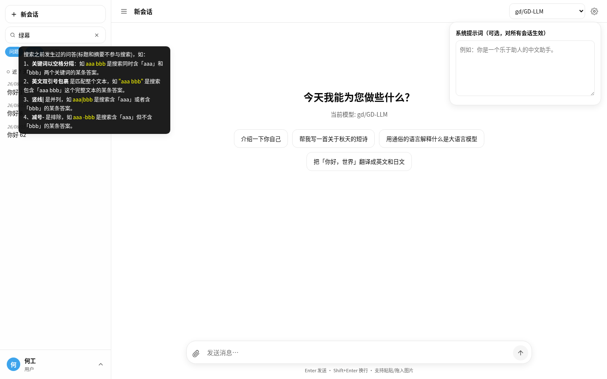


### D5 安全边界

- 生产站点只读验证（Z11）：登录 / 搜索 / 打开会话 / 截图，不发消息、不删除、不改密钥与钱包；
- 本轮经用户批准的三项放宽：①改在隔离实例自测；②允许发 1 条测试消息；③测试账号 18800008669 配万能密码（A03）；
- 隔离实例用完即停；`/data` 生产进程与文件全程未被助手启停或写入（Z10）。

---

*文档版本：2026-08-17 · 截图 39 张见 `README.res/`（36 张功能编号图 + 3 张 ZD 附录图）*
